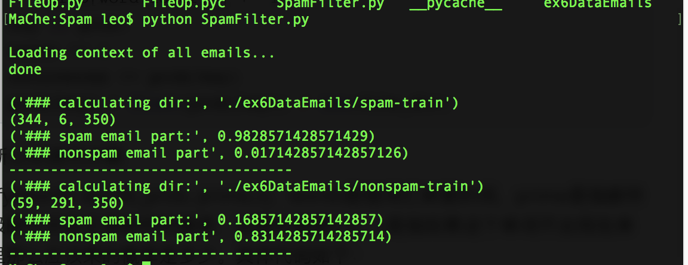
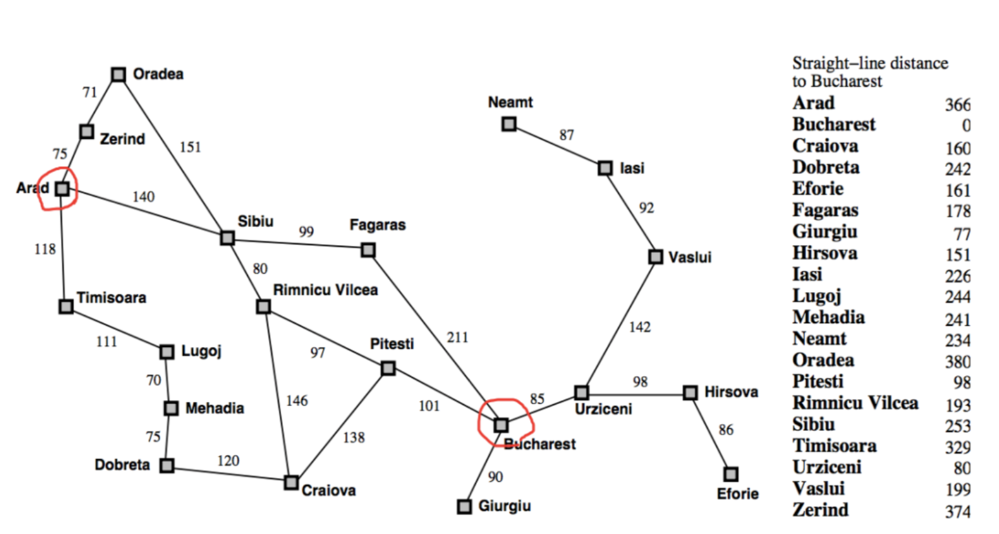
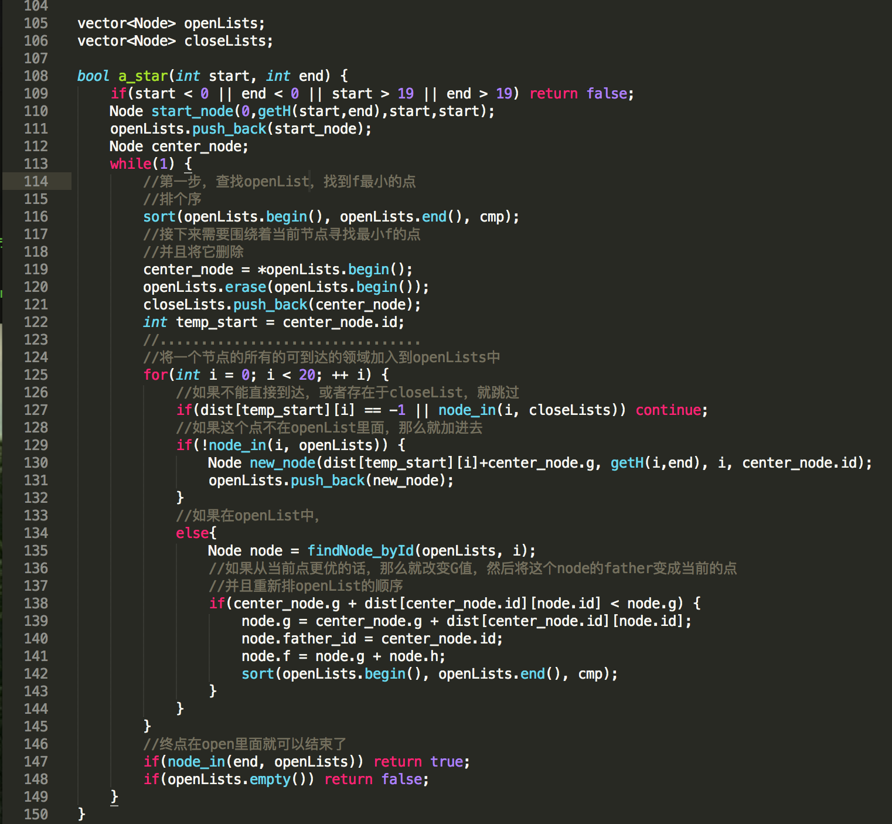
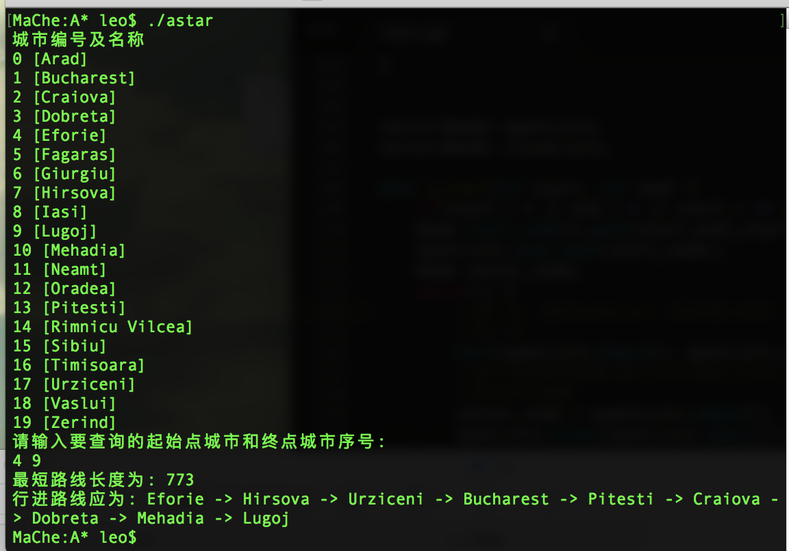

# 人工智能原理第一次作业

### 一、使用朴素贝叶斯定义进行垃圾邮件分类

> P(正常)= P(垃圾)=50% 
>
> 对这封新邮件的内容进行解析，发现其中含有“中奖”这个词，那么这封邮件属于垃圾邮件的概率提高到多少? 其实就是计算一个条件概率:P(垃圾|中奖)，通过贝叶斯定理 + 全概率公式可以计算。 
>
> 我们假设100封垃圾邮件中有5封包含“中奖”这个词，那么这个概率是5%。 P(中奖|正常)表示所有正常邮件中出现“中奖”的概率，我们假设1000封正常 邮件中有1封包含“中奖”这个词，那么这个概率是0.1%。 
>
> 那么: P(垃圾|中奖) = ?误判问题如何解决? 

#### 代码设计

将整体代码分成两部分：文件读写、概率计算

- 文件读写

  分成三个函数：

  - read_file_path(file_dir)，负责将目录下的文件名抽取出来，主要代码

  ```python
  or root, dirs, files in os.walk(file_dir):
          for name in files:
              file_names.append(root+'/'+name)
  ```

- - read_file_context(email_path)，读取每一个文件下的内容，主要操作就是通过空格将内容分开，并且全部都小写化，同时还需要注意的一点就是，如果这个单词长度小于3，那么就不需要统计这个单词了，因为两个字母的垃圾词汇很少。具体代码如下

  ```python
  text = ' '.join(text1)
      for i in text.split(' '):
          #almost words length less than 2 are not bad words
          if(len(i) <= 2):
              continue
          words.append(i)
  ```

  - words_probability(file_dir)，计算每个单词出现的概率，需要将目录下的所有文件都打开然后整合后，在进行计算，这里使用**字典**好一点，我之前犯了一个错误，就是使用每一个单词的出现次数处以所有单词出现的次数。这是不对的，我们求的单词出现的概率因该是**单词出现的次数处以文件的数量**。这里我还求了一个**平均概率值**，这个值是用来后面如果某个词没有出现在词汇表里，那么我认为他的概率就是这个平均概率，所以乘这个概率。代码如下：

  ```python
      email_paths = read_file_path(file_dir)
      words = []
      for email_path in email_paths:
          words.append(read_file_context(email_path))
          #words means all context in all emails
          #it's struct is [[],[]...]
      prob = {} #dictionary
      count = 0
      occurences = 0
      for single_words in words:
          for word in single_words:
              #count += 1
              if word not in prob:
                  prob[word.lower()] = 1
                  continue
              prob[word.lower()] += 1
      for key in prob:
          count += 1
          occurences += prob[key]
          prob[key] = float(prob[key]) / len(file_dir)
  ```

- 使用贝叶斯公式进行计算

  - classify(words, words_prob, prime,c)，words是指词汇表里的词，prime是指邮件是垃圾邮件还是正常邮件的概率，这里的值是0.5，c是指如果这个单词不出现在单词表里那么应该乘的概率是多少。具体代码如下：

  ```python
      prob = 1
      for word in words:
          if word in words_prob:
              prob *= words_prob[word]
          else:
              prob *= (c*1.2)
      return prob*prime
  ```

#### 结果截图



这里还是存在蛮大误差的。有两种方法降低这个误差。

1. 降低Spam邮件的概率，因为0.5实在是太大了
2. 适当的调高C的值*（没有出现在单词表中，应该乘的概率）*

> 可在命令行中输入：
>
> **python SpamFilter.py**
>
> 需要注意需要进入到了本文件夹中才行

### 二、A Star算法的实现

> 利用A*算法找到从A城市到B城市的最短路径，以及代价，其中A *算法中的h也就是从当前点到目标点的距离已经给出。程序要有通用性，即其中城市A、B可以为下图中任意的两个城市



*在做这个作业时我感觉数据给的不完整，说真的二维图论搜索基本是上按照两点之间的距离作为启发式函数，数据里只给了其他点到一个点直线距离，所以如果城市增多，那么我的这个启发式函数就可能不适用*

#### A*算法简介

> 假设此时起始点是A，中间点是B，目的地点是C

有三个参数

- h是启发式函数，在本题里面表示**无视所有障碍**，B到C的距离，一般是直线距离
- g表示cost，也就是A到B走的距离，这个不能无视障碍
- f总的路径长，对于B来说他的f就是$$g+h$$

有两个容器

- openList，经过中心点向四周辐射，将可到达的点放入到openList中，并且按照f，h的大小顺序进行排序，下一次选择中心点就选择f最小的，如果f一样小，就选择h最小的，因为h小的话代价就会小
- closeList，上面我们每一次都选择f、h最小的*f小优先*作为新的中心点，那么这个点就可以从openList中删除了，然后加入到closeList中，这个容器类似于visit[]数组，就是用来做标记的。但是他的功能不仅于此，还可以通过closeList来回溯出从起始点到终点的路径

#### 启发式函数设计

由于没有给出来所有点之间的直线距离，所以就将两城市到Bucharest的直线的距离的差的绝对值作为启发式函数

```c++
//采用起始点和终点到B城市的直线距离的差的绝对值用来做H
int getH(int start, int end) {
    return abs(strai_dist_B[start] - strai_dist_B[end]);
}
```

#### 具体实现

数据结构：

- 定义一个结构体Node表示每一个节点，id表示着城市的序号，father_id表示他之前点的序号

```c++
struct Node{
    int f;
    int g;
    int h;
    int id; //城市的序号
    int father_id;
    Node() {
        f = 0;
        g = 0;
        h = 0;
        id = -1;
        father_id = -1;
    }
    Node(int g, int h, int id, int father_id){
        this->h = h;
        this->g = g;
        this->id = id;
        this->f = g+h;
        this->father_id = father_id;
    }
};
```

一共有三个大步骤

首先我们要将起始点加入到openList中，这个不算三步里面。

1. 对openList进行排序，排序的规则是最小原则，f优先于h。找出来最小的节点，并且将其设定为中心点，然后将改点从openLIst中删除，并且加入到clsoeList中。

   ```c++
   //这个是排序函数，肯定是先排f较小的
   //如果出现f相等了，那么就看他们的h，如果h越小，那么说明离的越近
   bool cmp(const Node& node1, const Node &node2) {
       if(node1.f < node2.f) return true;
       else if(node1.f > node2.f) return false;
       else {
           if(node1.g < node2.g) return true;
       }
       return false;
   }
   
   
   ```

2. 从中心点开始遍历周围**可以到达**的点。在这一题里面就是找到临近的城市

- 1. 临近城市、不在closeList中

  2. 如果不在openList中，就加入到openList，并且将father_id设置为中心节点的序号

  3. <font color = "red">如果在openList中</font>，需要判断B点（*假设这个点是B，中心点是A*）是否需要进行更新。更新的原则就是：

     ```python
     if(dist[A.id][B.id] + A.g < B.g):
     	B.g = dist[A.id][B.id] + A.g
       B.father.id = A.id
     ```

     此时整个openList需要进行从新排序

3. 如果终点在了openList中，那么这个算法就可以停止了，如果最后openLIst空了，那么就搜索失败了

上述三步代码如下



#### 运行截图




