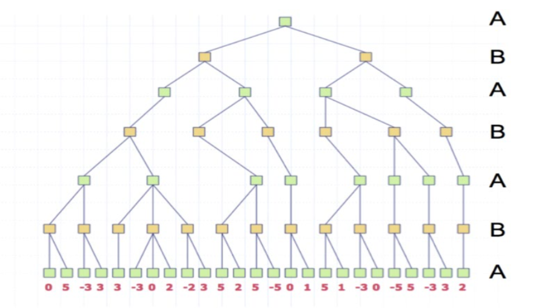
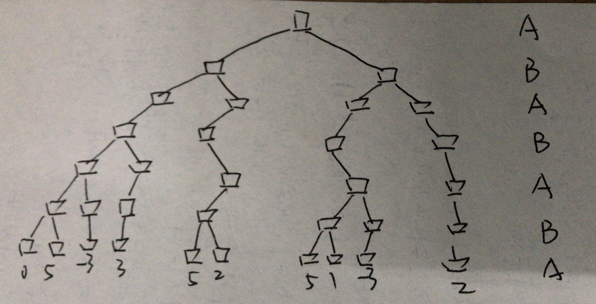
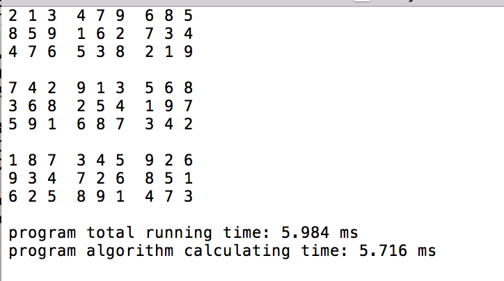
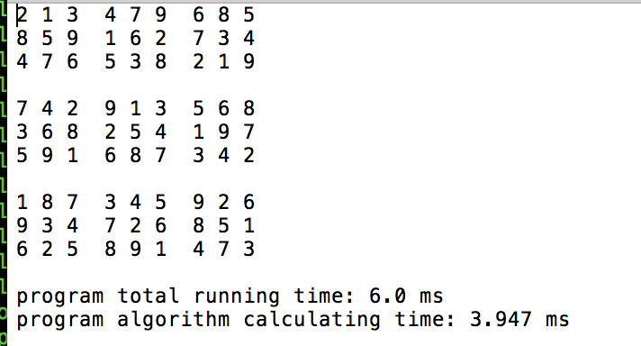
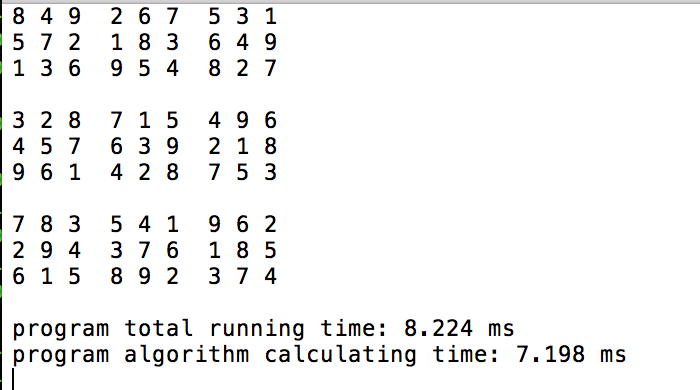
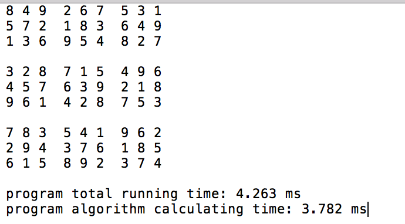
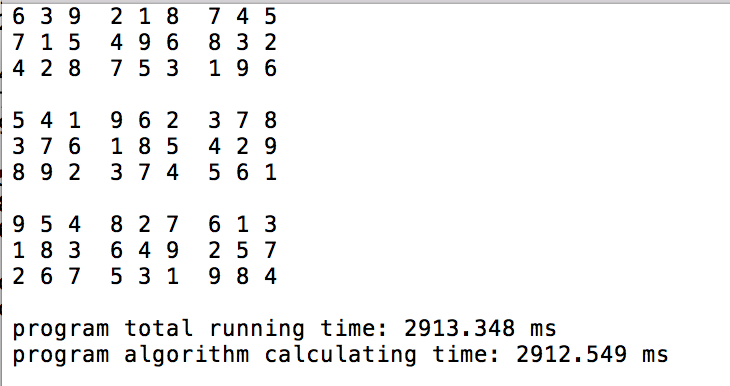
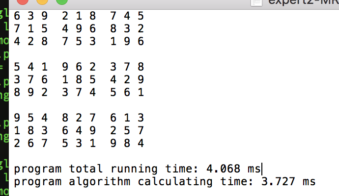

# 人工智能原理第二次作业

### 一、alpha beta pruning

> Draw the diagram after alpha beta pruning



- 经过剪枝后的结果



### 二、数独游戏

> 这一题我使用了两种算法：简单回溯和MRV，为了使两种算法看起来更加清晰，我将两种算法分成了两个PY文件，所以编译运行时，会和要求的略微不同

#### 1、回溯算法

其实就是DFS，类似于**八皇后问题**，对于这个思路，最主要的就是如何进行判断这个数字是否符合要求，其实很简单，就是分别判断：所在行、列、3*3九宫格，是否有重复数据，伪代码如下

```python
for i in rows:
  check value == i
for i in cols:
  check value == i
for i in 3*3grid:
  check value == i
```

#### 2、MRV算法

> 由于自带python版本较低，无法识别中文注释，所以使用了英文注释，但是英语水平不好，见谅

这其实是回溯算法的升级版，简单的回溯就像是盲人一样，只能慢慢的进行尝试来达到终点，而MRV就像是长了眼睛，他可以通过一些简单的“思考”权衡下一步该向哪里走，从而减少尝试的次数

- 这里通过一个点，他拥有的约束来进行更好的执行策略。一个点相关的约束有：所在行、列、3*3九宫格。如果我们能够将每个点约束情况先计算出来，然后权衡最大可能情况，<font color = "red">优先选择那些**可选值较少**的点，会极大的节省尝试时间</font>。

首先，需要选择好数据结构，便于我们计算和更新可能的情况，这里选择字典是最好不过的选择，

- 有四个变量需要解释：

```python
def cross(A,B):
    return [a+b for a in A for b in B]

digits = '123456789'
rows_num = digits
cols_num = '123456789'
sudoku_pos = cross(rows_num,cols_num)
# dataList = []
#unitlist has three parts
#all rows
#all cols
#all 3*3 grids
three_check_part = [[row+col for row in rows_num] for col in cols_num] + [[row+col for col in cols_num] for row in rows_num] + [[row+col for row in rows for col in cols] for rows in ('123','456','789') for cols in ('123','456','789')]

#units
#key is every 81 pos
#value is the row col grid the pos belonged to
total_Pos_check = dict((index, [check_space for check_space in three_check_part if index in check_space])for index in sudoku_pos)

#every pos has 20 peers 9+9-2+9-5
single_Pos_check = dict((index, (set(total_Pos_check[index][0] + total_Pos_check[index][1] + total_Pos_check[index][2]) - set([index]))) for index in sudoku_pos)
```

- 选择的时候更具有目标性，对search函数略作修改

```python
 #choose the little possibility key
    next_length,next_key = min((len(values[pos]), pos) for pos in sudoku_pos if len(values[sn]) > 1) 
    
```

#### 3、运行截图

- 运行方法，使用命令行进入到本目录下，然后输入

  ```
  python bt.py easy1.txt   # 回溯算法
  python mrv.py east1.txt		# MRV算法
  ```

- easy

BT：



MRV：



- hard

BT:



MRV:



- expert

BT:



MRV:



- 分析

在简单、困难两种难难度下MRV计算时间略短于BT，但是到了“专家难度”，发现BT计算时间急剧增加，而MRV比较之前没有较大的波动，可以看出来MRV算法在数独难度提高的情况下，具有很好的解决能力

